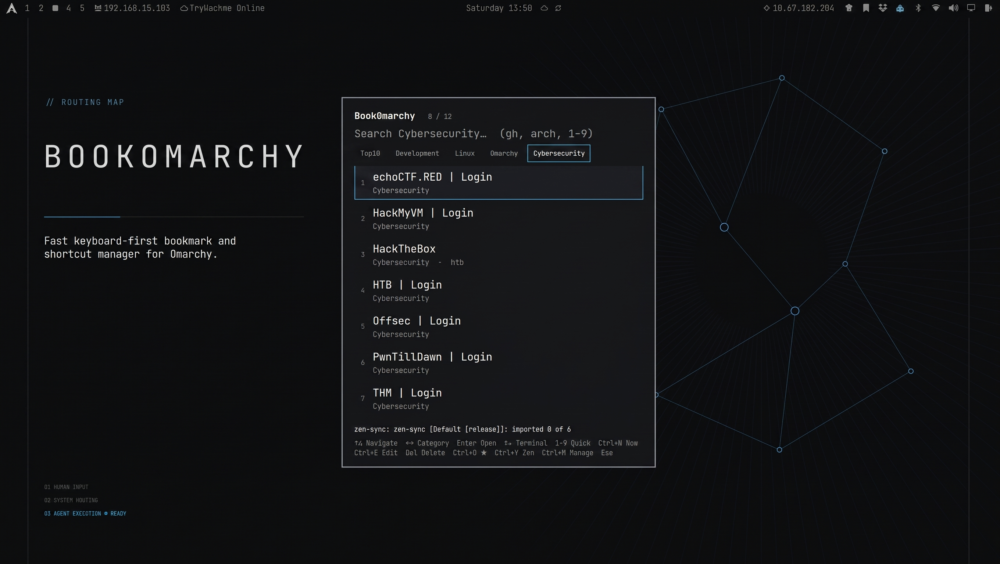
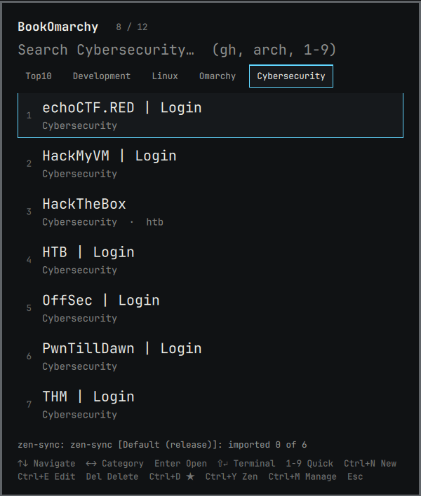
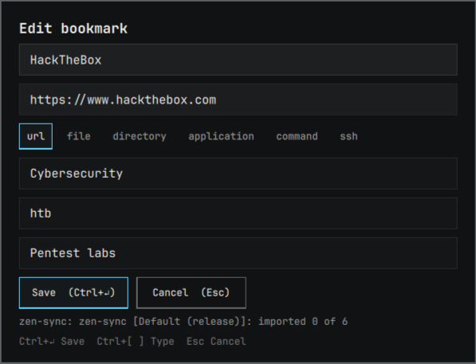
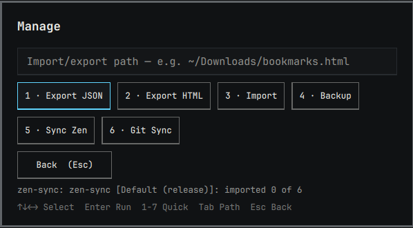
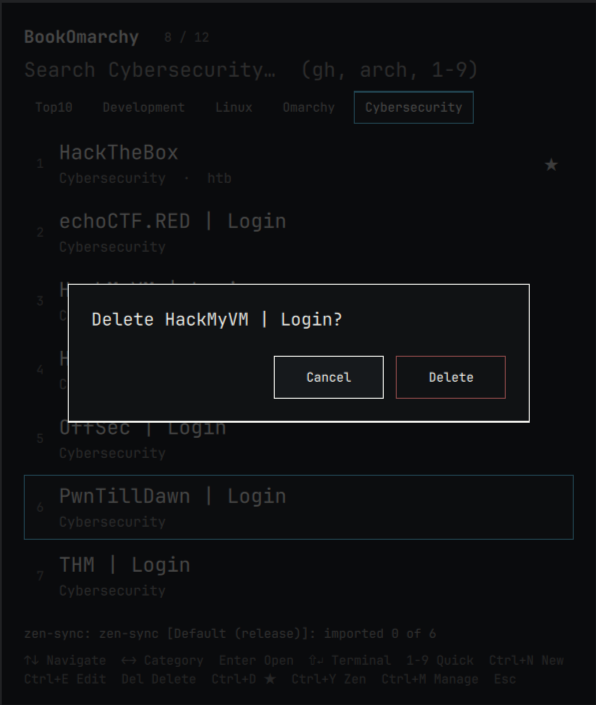

<h1 align="center">BookOmarchy</h1>



Fast keyboard-first bookmarks and shortcuts for Omarchy.

ID: `eudionelima.bookomarchy` · kinds `menu` + `bar-widget` · `SUPER+B`

<h2 align="center">Screenshots</h2>

<table>
  <tr>
    <td align="center"><b>Browse & Top10</b><br></td>
    <td align="center"><b>Edit bookmark</b><br></td>
  </tr>
  <tr>
    <td align="center"><b>Manage</b><br></td>
    <td align="center"><b>Delete confirm</b><br></td>
  </tr>
</table>

<h2 align="center">Features</h2>

- Search across title, URL/target, category, aliases, tags (`gh` → GitHub, `arch` → ArchWiki)
- `Top10` default view: 10 most opened (favorites as tiebreak) — every launch bumps the counter, no mouse needed
- `↑↓` navigate · `←→` or `[` `]` switch category · `1-9` quick-open · `Shift+Enter` opens a directory in the terminal
- Quick-keys `1-9`: type `3` + `Enter` opens the 3rd visible row
- Categories with `[` / `]` cycling + click filter
- Types: `url` (browser), `file`/`directory` (`xdg-open`), `application` (app library), `command`/`ssh` (confirmed)
- `Ctrl+N` new · `Ctrl+E` edit · `Del` delete · `Ctrl+D` favorite · `Ctrl+B` backup · `Ctrl+Y` zen-sync · `Ctrl+M` manage
- Manage sem mouse: `↑↓←→` seleciona · `Enter` executa · `1-7` atalho direto · `Tab` vai ao campo de path · `Esc` volta
- Formulário sem mouse: `Ctrl+[` / `Ctrl+]` troca o tipo (url/file/directory/application/command/ssh)
- `Shift+Enter` on a directory opens it in the terminal
- Import Chrome/Firefox HTML, JSON, CSV · export JSON/HTML · timestamped backups · local git sync
- Adapts to `omarchy theme set` live: all colors from `Color.menu.*`, spacing/type from `Style.*`

<h2 align="center">Install</h2>

```bash
# dev (local dir already in place)
omarchy plugin validate ~/.config/omarchy/plugins/eudionelima.bookomarchy
omarchy-shell shell rescanPlugins
omarchy plugin enable eudionelima.bookomarchy

# from git (marketplace layout: manifest.json at repo root)
omarchy plugin add https://github.com/<you>/bookomarchy --enable
```

<h2 align="center">Use</h2>

```bash
omarchy-shell shell summon eudionelima.bookomarchy '{}'
omarchy-shell shell summon eudionelima.bookomarchy '{"filter":"gh"}'
omarchy-shell shell summon eudionelima.bookomarchy '{"mode":"manage"}'
omarchy-shell shell summon eudionelima.bookomarchy '{"mode":"add"}'
```

Hyprland:

```ini
bind = SUPER, B, exec, omarchy-shell shell toggle eudionelima.bookomarchy '{}'
bind = SUPER SHIFT, B, exec, omarchy-shell shell summon eudionelima.bookomarchy '{"mode":"manage"}'
```

<h2 align="center">Bar icon</h2>

Left-click the bookmark icon toggles the menu, right-click opens manage mode.
The icon uses the bar's own foreground/font, so it follows every theme.

```bash
omarchy plugin enable eudionelima.bookomarchy --section right
```

<h2 align="center">Data (never inside the plugin repo)</h2>

```
~/.config/omarchy/bookomarchy/
  bookmarks.json
  settings.json          # { "maxResults": 12, "confirmDelete": true, "confirmCommand": true, "zenSync": {...} }
  backups/bookomarchy-backup-YYYY-MM-DD-HHMM.json
```

<h2 align="center">Zen sync (automático)</h2>

Puxa favoritos do Zen Browser (`~/.config/zen`, Firefox-compatible) sem dependências extras.
Lê `bookmarkbackups/*.jsonlz4` primeiro (sem lock) e cai para cópia via `sqlite3 backup` de `places.sqlite` se preciso. Só lê título/URL/pasta — nunca logins/cookies. Merge é por URL normalizada: URL nova entra com `tags: ["zen"]`, URL existente **mantém seu título/favorito/tags** do BookOmarchy.

```bash
bin/bookomarchy-maintenance zen-sync --dry-run
bin/bookomarchy-maintenance zen-sync
bin/bookomarchy-maintenance zen-sync --profile="Default (release)" --category=Zen
```

UI: botão `Sync Zen` no modo Manage + `Ctrl+Y` no browse + auto a cada abertura do menu (uma vez por abertura). Desligue em `settings.json`:

```json
{ "zenSync": { "enabled": true, "auto": true, "category": "Zen" } }
```

Exclusões (nunca importados, ex. bookmarks padrão do Firefox):
```json
{ "zenSync": { "exclude": ["support\\.mozilla\\.org", "mozilla\\.org/(contribute|about)"] } }
```

<h2 align="center">Maintenance CLI (same code the UI calls)</h2>

```bash
bin/bookomarchy-maintenance backup
bin/bookomarchy-maintenance export-json ~/Downloads/bookmarks.json
bin/bookomarchy-maintenance export-html ~/Downloads/bookmarks.html
bin/bookomarchy-maintenance import ~/Downloads/bookmarks.html
bin/bookomarchy-maintenance zen-sync --dry-run
bin/bookomarchy-maintenance git-sync
```

<h2 align="center">Security</h2>

See `SECURITY.md`. Summary: `url/file/dir/app` launch without shell;
`command/ssh` always confirm; dangerous patterns refused; no secrets stored;
saves go over stdin, never `bash -c` interpolation.

<h2 align="center">Remove</h2>

```bash
omarchy plugin disable eudionelima.bookomarchy
omarchy plugin remove eudionelima.bookomarchy
# user data stays in ~/.config/omarchy/bookomarchy/ — delete manually if wanted
```
